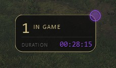
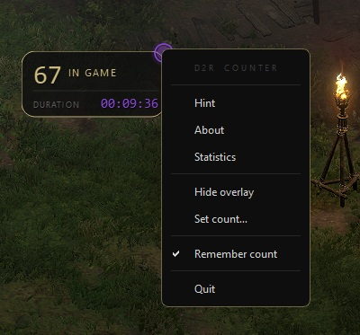
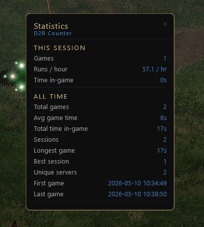
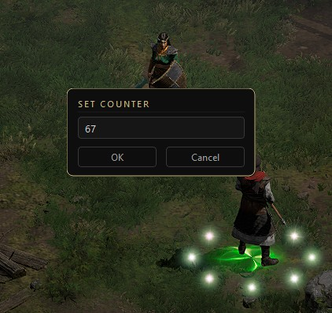
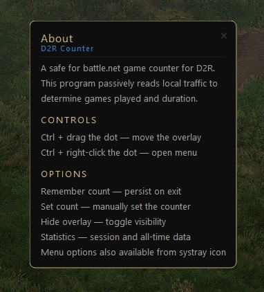
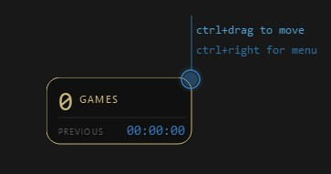

# D2R Counter

Passive game-session tracker for Diablo II: Resurrected. Reads local TCP traffic to detect game joins and leaves — no manual input, no game interaction required. Safe for battle.net!

<table>
  <tr>
    <td align="center"><br><sub>Overlay</sub></td>
    <td align="center"><br><sub>Menu</sub></td>
    <td align="center"><br><sub>Statistics</sub></td>
  </tr>
  <tr>
    <td align="center"><br><sub>Set Counter</sub></td>
    <td align="center"><br><sub>About</sub></td>
    <td align="center"><br><sub>Hint</sub></td>
  </tr>
</table>

---

## Table of Contents

- [Requirements](#requirements)
- [Installation](#installation)
- [Usage](#usage)
- [Safe for Battle.net](#safe-for-battlenet)
- [License](#license)

**Technical Reference**

- [Why It's Safe for Battle.net](#why-its-safe-for-battlenet)
- [How Detection Works](#how-detection-works)
  - [The BPF Filter](#the-bpf-filter)
  - [Connection Candidates and the State Machine](#connection-candidates-and-the-state-machine)
  - [The Classifier](#the-classifier)
  - [Threshold Reference](#threshold-reference)
  - [Log-Driven Threshold Tuning](#log-driven-threshold-tuning)
- [Data Files](#data-files)
- [Building from Source](#building-from-source)

---

## Requirements

- Windows 10 / 11
- [Npcap](https://npcap.com/#download) with *WinPcap API-compatible mode* enabled
- Administrator privileges
- D2R.exe — does not need to be running at launch

---

## Installation

**[Download latest release →](https://github.com/USERNAME/D2RCounter/releases/latest)**

Extract anywhere. Right-click `D2RCounter.exe` → **Run as administrator**.

**Npcap** ships with Wireshark and may already be installed. To check:

```
sc query npcap
```

`STATE: 4  RUNNING` means you're good. Otherwise [download Npcap](https://npcap.com/#download) and enable WinPcap compatibility during setup.

**From source:**

```
git clone <repo-url>
cd D2RCounter
pip install scapy psutil PyQt6
python main.py        # must be run as Administrator
```

`stats.json`, `config.json`, and `logs/` are created on first run.

---

## Usage

The overlay is a dot (blue = idle, purple = in-game) and a click-through stat panel. Drag and menu access are on the dot only.

| Action | Result |
|---|---|
| `Ctrl` + left-drag dot | Move overlay |
| `Ctrl` + right-click dot | Open menu |
| Right-click tray icon | Same menu |

| Option | Description |
|---|---|
| **Statistics** | Session and all-time stats |
| **Hide / Show overlay** | Toggle visibility |
| **Set count…** | Manually set counter (0–99,999) |
| **Remember count** | Persist counter across restarts |
| **Quit** | Save all data and exit |

Overlay position is saved on quit and restored on next launch.

---

## Safe for Battle.net

Read-only packet capture only — no process injection, no memory access, no game file interaction, no outbound connections. See [full breakdown below](#why-its-safe-for-battlenet).

---

## License

MIT — see [full text below](#license-1).

---

## Why It's Safe for Battle.net

**Entirely passive and read-only. No data is ever sent, modified, or injected.**

- **No packet injection.** Scapy opens the network interface in read-only mode via Npcap. It receives copies of packets from the driver and never writes to the network.

- **No process interaction.** D2R Counter does not attach to `D2R.exe`, read or write its memory, hook Windows APIs, or inject code. `psutil` reads only the OS process list and TCP connection table — the same data visible in Task Manager and `netstat`.

- **No game file interaction.** No Diablo II game files, save files, or registry entries are read, written, or modified.

- **No external communication.** Zero outbound connections. No telemetry, no update checks, no analytics.

- **Port ownership verification.** Before tracking any connection, `psutil.net_connections()` confirms the local TCP port belongs to `D2R.exe`'s PID — filtering out browsers, update services, and other port-443 traffic before any tracking begins.

- **Payload content is never read.** Only direction, size, and timing are used. The BPF filter limits capture to TCP port 443 on the local IP; payload bytes are not inspected, logged, or stored.

Battle.net's anti-cheat (Warden) targets code injection, memory modification, API hooking, and unauthorized game process interaction. D2R Counter does none of these. It is a passive traffic analyser watching its own network card.

---

## How Detection Works

### The BPF Filter

Npcap captures at the driver level before the OS TCP stack. D2R Counter passes a **Berkeley Packet Filter (BPF)** expression on sniffer start:

```
tcp port 443 and (src host <LOCAL_IP> or dst host <LOCAL_IP>)
```

BPF runs inside the capture driver as kernel bytecode — non-matching packets are dropped before Python sees them. Effect:

- UDP, ICMP, and other protocols: dropped at the driver.
- Non-port-443 TCP: dropped. D2R game servers use port 443 exclusively.
- Traffic between other hosts on the LAN: dropped.

On a busy network the raw rate may be thousands of packets/sec; after BPF, D2R Counter typically handles a handful.

---

### Connection Candidates and the State Machine

```
         SYN-ACK from external:443, local port verified to D2R.exe PID
  IDLE ──────────────────────────────────────────────────────────────► TRACKING
   ▲                                                                        │
   │  All candidates expire (no burst within DATA_BURST_WINDOW = 6s)        │  is_game_like() → True
   │◄───────────────────────────────────────────────────────────────────────┤
   │                                                                        ▼
   └──────────────────────────────────────────────────────────────────── IN_GAME
                         Outbound FIN+ACK on the tracked connection
```

**IDLE** — No tracking. Inbound data ignored.

**TRACKING** — One or more `Conn` candidates exist, keyed by `(server_ip, server_port, local_port)`. Each inbound packet is measured and tested. A candidate with no burst within 6s of its SYN-ACK is discarded; state returns to IDLE if no candidates remain.

**IN_GAME** — A candidate passed the classifier. Only the outbound FIN+ACK on that connection returns state to IDLE.

Port 443 is used by many applications. On each SYN-ACK, `psutil.net_connections()` verifies the destination local port belongs to `D2R.exe`'s PID before any `Conn` is created.

---

### The Classifier

`is_game_like()` is called on every inbound data packet. Checks run in order.

#### Disqualifiers — any one rules the connection out

**Inbound shape:**

| Check | Threshold | Rationale |
|---|---|---|
| Inbound ratio | ≥ 80% of total bytes inbound | Game downloads world state; auth flows are more symmetric |
| Consecutive large packets | ≥ 2 consecutive packets > 1000 b | Sustained large-packet stream vs. scattered credential exchange |
| MTU-sized packets | ≥ 2 packets ≥ 1400 b | Near-MTU indicates bulk transfer characteristic of game data |

**Outbound shape:**

| Check | Threshold | Rationale |
|---|---|---|
| Max outbound packet | ≤ 500 b | In-game client messages are tiny; large early outbound = credential exchange |
| Avg outbound size | ≤ 180 b (after ≥ 3 packets) | Login flows send larger outbound packets than in-game keepalives |

#### Positive signals — any one confirms the join

**`consec_fast` override** (highest confidence) — 12+ consecutive inbound packets with inter-arrival gap < 5ms. Extremely specific to the initial world download; never produced by non-game connections in collected data.

**`early_large`** — A single packet > 4000 b arrives within 0.8s of SYN-ACK, AND total inbound ≥ 15,000 b, AND peak burst ≥ 8,000 b. Captures server-push of initial world state immediately after handshake.

**`rapid_burst`** — Peak inbound in any 0.75s sliding window exceeds 10,000 b. Primary detection path for most joins.

`peak_burst()` uses a two-pointer algorithm: as the lead pointer advances through the inbound packet list, the trail pointer advances whenever the window duration is exceeded, keeping the running sum accurate in O(n) without recomputing per packet.

---

### Threshold Reference

| Constant | Value | Role |
|---|---|---|
| `EARLY_LARGE_PKT` | 4,000 b | Single-packet size for the early-large path |
| `EARLY_LARGE_WINDOW` | 0.8 s | Max time after SYN-ACK for qualifying large packet |
| `EARLY_LARGE_MIN` | 15,000 b | Min total inbound bytes alongside early large |
| `EARLY_LARGE_BURST` | 8,000 b | Min peak burst alongside early large |
| `RAPID_BURST_BYTES` | 10,000 b | Peak inbound bytes in any sliding window |
| `RAPID_BURST_WINDOW` | 0.75 s | Sliding window duration |
| `GAME_MIN_INBOUND_RATIO` | 0.80 | Min inbound fraction of total bytes |
| `GAME_MIN_CONSEC_LARGE` | 2 | Min consecutive large (> 1000 b) streak |
| `GAME_MIN_MTU_PACKETS` | 2 | Min near-MTU (≥ 1400 b) packets |
| `GAME_MAX_OUTBOUND_SINGLE` | 500 b | Max single outbound packet |
| `GAME_MAX_OUTBOUND_AVG` | 180 b | Max average outbound size (after ≥ 3 packets) |
| `GAME_MIN_OUTBOUND_SAMPLE` | 3 | Min outbound packets before avg check fires |
| `CONSEC_FAST_CERTAIN` | 12 | Consecutive fast inbound packets for immediate override |
| `DATA_BURST_WINDOW` | 6.0 s | Candidate expiry window |
| `EARLY_ABANDON_SECONDS` | 60 s | Games below this are tagged early-abandon in logs |

All constants are at the top of `main.py`.

---

### Log-Driven Threshold Tuning

Thresholds were derived empirically from real D2R traffic.

`packet.log` records every inbound data packet for every candidate with all classifier metrics: size, cumulative bytes, peak burst, consecutive large streak, consecutive fast count, inbound ratio, outbound count/sizes, connection age. Disqualifications log the failing check; promotions log a full metric summary.

**Tuning process:**

1. Set `enable_packet_log: true` in `config.json`.
2. Play normally — joins, exits, character switches, logins, shop, menus.
3. In `packet.log`, check `JOINED` entries (correct connection promoted? what were the metrics?) and `EXPIRED` entries (`reason=[...]` shows which disqualifier fired — was it correct?).
4. Find the metric ranges separating true positives (game joins) from false positives (auth, lobby, CDN).
5. Adjust thresholds. Repeat.

The `DISQ=[...]` field makes adjustments surgical — it shows the exact failing condition, not just that a candidate expired.

---

## Data Files

### stats.json

All game statistics. Written atomically on every event via `.tmp` + `os.replace()`.

```json
{
  "alltime": {
    "total_sessions": 12,
    "total_games": 847,
    "total_game_seconds": 304200,
    "total_app_seconds": 86400,
    "most_games_in_session": 143,
    "longest_game_seconds": 1802,
    "first_game_at": "2024-11-01 19:32:14",
    "last_game_at":  "2025-04-30 22:11:09",
    "unique_servers": ["12.34.56.78:443", "98.76.54.32:443"]
  },
  "last_run": {
    "started_at": "2025-04-30 20:00:00",
    "ended_at":   "2025-04-30 22:11:09",
    "games": 87,
    "game_seconds": 18200,
    "elapsed_seconds": 7869,
    "crashed": false
  }
}
```

Can be edited manually — missing keys are merged against defaults on next load. If a session has `started_at` but no `ended_at`, the unclean exit is logged and printed on next start; stats are preserved.

### config.json

User preferences. Created on first setting change or clean quit.

```json
{
  "hint_shown": true,
  "last_seen_counter": 87,
  "continue_from_last": false,
  "overlay_x": 960,
  "overlay_y": 540,
  "enable_packet_log": true,
  "enable_run_log": true
}
```

| Key | Default | Description |
|---|---|---|
| `hint_shown` | `false` | First-launch hint dismissed |
| `last_seen_counter` | `0` | Counter saved at last game leave (Remember count) |
| `continue_from_last` | `false` | Remember count enabled |
| `overlay_x` / `overlay_y` | `null` | Overlay position; falls back to screen centre |
| `enable_packet_log` | `true` | Write `logs/packet.log` |
| `enable_run_log` | `true` | Write `logs/run.log` |

### Log Files

**`logs/run.log`** — One line per event: starts, stops, joins (server IP, game number), leaves (duration), D2R process found/lost, crash warnings. Rotates at 2 MB, 5 backups.

```
2025-04-30 20:00:00  *** APPLICATION STARTED ***
2025-04-30 20:01:43  GAME JOINED  #1  server=12.34.56.78:443
2025-04-30 20:03:28  GAME LEFT    #1  server=12.34.56.78:443  (duration: 1m 45s)
```

**`logs/packet.log`** — Per-packet classifier detail for every candidate. Records CANDIDATE, JOINED, EXPIRED, DISQ events. Used for threshold tuning. Rotates at 5 MB, 3 backups.

```
2025-04-30 20:01:41  INFO   CANDIDATE  12.34.56.78:443  local:54321  tracking=1
2025-04-30 20:01:41  DEBUG    pkt=4218b  total=4218b  peak_0.75s=4218b  consec_large=1  ratio=1.00
2025-04-30 20:01:42  DEBUG    pkt=8934b  total=13152b  peak_0.75s=13152b  consec_large=2
2025-04-30 20:01:42  INFO   JOINED  12.34.56.78:443  total=18540b  ratio=0.98
```

---

## Building from Source

Uses [PyInstaller](https://pyinstaller.org) in `--onedir` mode: a folder with the exe and unpacked dependencies.

`stats.json`, `config.json`, and `logs/` are runtime-generated. Do not bundle them.

### build.bat

Run from an Administrator command prompt in the project root. Prompts for build type:

- **Release** (`--noconsole`) — no terminal window.
- **Dev** (`--console`) — terminal visible, same console output as running from source (e.g., python main.py).

### Scapy Hidden Imports

If the packaged exe crashes on startup with an `ImportError`, add to the PyInstaller command:

```
--hidden-import scapy.layers.all
--hidden-import scapy.layers.inet
--hidden-import scapy.arch.windows
```
---

## License

MIT License

Copyright (c) 2025

Permission is hereby granted, free of charge, to any person obtaining a copy of this software and associated documentation files (the "Software"), to deal in the Software without restriction, including without limitation the rights to use, copy, modify, merge, publish, distribute, sublicense, and/or sell copies of the Software, and to permit persons to whom the Software is furnished to do so, subject to the following conditions:

The above copyright notice and this permission notice shall be included in all copies or substantial portions of the Software.

THE SOFTWARE IS PROVIDED "AS IS", WITHOUT WARRANTY OF ANY KIND, EXPRESS OR IMPLIED, INCLUDING BUT NOT LIMITED TO THE WARRANTIES OF MERCHANTABILITY, FITNESS FOR A PARTICULAR PURPOSE AND NONINFRINGEMENT. IN NO EVENT SHALL THE AUTHORS OR COPYRIGHT HOLDERS BE LIABLE FOR ANY CLAIM, DAMAGES OR OTHER LIABILITY, WHETHER IN AN ACTION OF CONTRACT, TORT OR OTHERWISE, ARISING FROM, OUT OF OR IN CONNECTION WITH THE SOFTWARE OR THE USE OR OTHER DEALINGS IN THE SOFTWARE.
